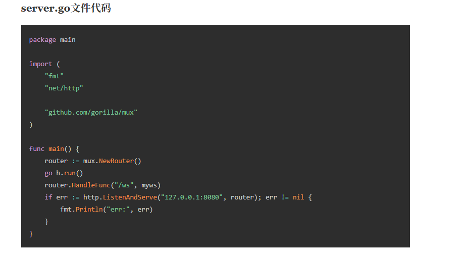

# 初识大模型

## 1. 大模型是什么
大模型（Large Language Model, LLM）通常指**参数规模很大**、在**海量文本数据**上进行预训练的神经网络模型。它的目标不是“背答案”，而是学习语言的统计规律：给定一段上下文，预测接下来最可能出现的 token（分词单位）。

把它理解成一个“**通用文本接口**”会更贴切：你用自然语言提出需求，它输出自然语言（或结构化文本）作为回应。

### 1.1 一句话定义（考试版）
- **LLM**：基于 Transformer 架构，在大规模语料上预训练得到的、以 token 预测为核心任务的通用语言模型。

### 1.2 它是怎么“学会”的（非常简化版）
一般会经历三类阶段（不同模型实现略有差异）：
- **预训练（Pretrain）**：在海量语料上做“补全下一个 token”的训练，获得通用语言能力与世界知识的粗糙表征。
- **指令微调（SFT, Instruction Tuning）**：用“指令-答案”数据，让模型更像助手，学会遵循格式、风格与任务要求。
- **对齐（RLHF / DPO 等）**：用人类偏好或排序信号，让回答更安全、更有帮助、更符合人类期待。

### 1.3 它到底在“做推理”吗？
大模型在生成时做的是**概率采样**：它会给出下一 token 的概率分布，然后按策略选一个 token 输出（可能更保守，也可能更发散）。

因此：
- 它**能表现出类似推理的行为**（特别是在“链式思考/工具调用/检索增强”配合下）。
- 但它并不等同于“拥有可靠、可解释的逻辑推理引擎”。

## 2. 它能做什么（典型能力）
下面是最常见、最稳定的一批能力（按日常开发与内容生产场景总结）：

### 2.1 语言与内容生成
- **写作**：文章/大纲/脚本/标题/摘要/改写/润色/风格迁移。
- **翻译与本地化**：术语统一、双语对照、口吻调整。
- **结构化输出**：生成 JSON/Markdown/表格/要点清单（只要你明确格式要求）。

### 2.2 理解与信息抽取
- **长文总结**：提炼要点、会议纪要、行动项（Action Items）。
- **抽取**：从文本中提取实体、字段、关系、事件（如“姓名/时间/金额/地点”）。
- **分类与判别**：情感/主题/风险分级/意图识别。

### 2.3 编程与工程辅助
- **代码生成/补全/解释**：根据需求生成函数、注释、README、示例。
- **Debug 辅助**：根据报错定位可能原因、给排查步骤、写最小复现。
- **重构建议**：抽象、命名、拆分模块、补单元测试用例（但需要你把约束说清楚）。

### 2.4 任务规划与流程编排（Agent 的基础）
当你提供目标、约束、资源（工具/接口/数据）时，大模型可生成：
- **执行计划**（步骤、检查点、回滚方案）
- **工具调用参数**（如搜索、数据库查询、代码执行）
- **多轮对话中的状态维护**（在上下文窗口允许的范围内）

> 实际工程里，“能做事”的关键往往不是模型多聪明，而是**给它工具**（搜索/数据库/代码执行）和**给它数据**（知识库/RAG）。

## 3. 它不能做什么（常见误区）
理解边界很重要——很多“翻车”都来自误用。

### 3.1 不保证事实正确（会“幻觉”）
大模型可能生成**看起来很合理但实际不存在**的内容：编造引用、捏造 API、虚构论文、错算数字。

应对方法：
- **要求给出处/引用**，并对关键事实进行外部校验
- 对企业知识使用 **RAG/数据库查询**，不要让它“凭空回忆”
- 对计算用 **工具**（代码执行、计算器、SQL）而不是纯生成

### 3.2 不等于实时搜索引擎
除非你接入了浏览器/搜索工具，否则模型：
- 不了解最新新闻与版本变更
- 无法确认某个网页当前是否存在/是否更新

### 3.3 不擅长绝对精确的长链条计算
长步骤算数、复杂符号推导、严格证明、精确到小数点后很多位的计算，都可能出错。

### 3.4 上下文有限（会“忘记”）
模型一次能处理的 token 数有限（这叫上下文窗口）。超过限制就必须截断或总结，因此：
- 长对话可能丢细节
- 贴太多代码/日志可能导致关键信息被挤出窗口

### 3.5 安全与合规边界
不同模型会对某些内容拒答或降级回答。工程上要做：
- 数据脱敏（密钥/隐私/商业机密）
- 权限控制（谁能问、能看到什么）
- 审计与日志（可追溯）

## 4. 核心概念速记
- Prompt（提示词）
- 你给模型的“任务描述 + 约束 + 输入数据 + 输出格式”。
- 好提示词的关键不是“花哨”，而是**明确、可检验、可复用**。

- Context（上下文）
- 模型本轮可见的信息集合：系统指令、历史对话、你粘贴的资料、工具返回等。
- 上下文越清晰，输出越稳定；无关内容越多，越容易跑偏。

- Token（分词/计费单位）
- 模型处理与计费的基本单位，不等于一个汉字/一个英文单词。
- 大致感觉：中文通常 1 个汉字≈1 token（不严格）；英文 3~4 个字符≈1 token（不严格）。

- Temperature（随机性）
- 控制输出发散程度的采样参数：
  - **低温（如 0~0.3）**：更稳、更像“确定性回答”，适合抽取/总结/写代码
  - **高温（如 0.7~1.2）**：更有创意，但更容易胡扯

- RAG（检索增强生成）
- **先检索，后生成**：从知识库/文档/数据库检索相关内容，把结果塞进上下文，再让模型回答。
- 用于：企业知识问答、基于文档的客服、法规/手册查询、代码库问答等。

### 4.1 额外再记 4 个（很常用）
- **System / Developer / User 指令层级**：系统指令通常优先级最高，用来定义角色与安全边界。
- **Top-p（nucleus sampling）**：从累计概率达到 \(p\) 的 token 集合里采样；和 temperature 常配合。
- **Stop sequences（停止词）**：遇到特定字符串就停止生成，便于控制输出边界。
- **Tool / Function calling（工具调用）**：模型按规范输出参数，系统去执行工具，再把结果回填给模型。

## 5. 实战：一个最小可用的提示词
目标：给你一个**可复制、可改字段**的模板，用在总结/写作/生成结构化结果等多数场景。

### 5.1 模板（直接复制用）
把方括号内容替换成你的实际信息：

```markdown
你是[角色]。
你的任务：根据【输入】完成【目标】。
硬性约束：
1) 必须遵守[规范/风格/字数/口吻]；
2) 不要编造事实；不确定就明确说“不确定”，并给出需要补充的信息清单；
3) 输出必须是【输出格式】（例如 JSON / Markdown 列表 / 表格）。

【输入】
[粘贴资料/需求/数据]

【输出格式】
[写清楚字段、示例、以及是否允许多余字段]
```

### 5.2 示例：把一段文字总结成“要点 + 行动项”
```markdown
你是资深项目经理。
你的任务：把【输入】整理成会议纪要。
硬性约束：
1) 先给 5 条以内“结论要点”；再给“行动项”（包含负责人/截止时间/验收标准）；
2) 不要编造：如果负责人或时间没给出，用“待定”并列出需要确认的问题；
3) 输出用 Markdown。

【输入】
（粘贴会议记录/聊天记录）

【输出格式】
- 结论要点：...
- 行动项（表格）：| 事项 | 负责人 | 截止时间 | 验收标准 |
- 待确认问题：...
```

### 5.3 常见小技巧（立刻见效）
- **给例子**：你想要的输出长什么样，直接给一条示例。
- **可检验约束**：字数范围、字段名、不得出现的词、必须包含的内容。
- **先问再答**：当输入信息可能不足时，让模型先提出澄清问题再输出最终结果。

## 6. 延伸阅读
- **Transformer 原论文**：*Attention Is All You Need*（理解注意力机制与自注意力）
- **对齐与 RLHF**：理解“为什么助手更像人”和“为什么会拒答”
- **RAG 工程化**：向量检索、chunk 切分、召回/重排、引用与可追溯
- **提示词与评测**：用小样本集做回归测试，避免提示词一改性能就漂移

> 如果你希望这篇笔记更贴近你的项目实践（比如你会用 LangChain），我可以在下一节补一篇：**“用 LangChain 做一个最小 RAG：从本地 Markdown 到可引用回答”**。

